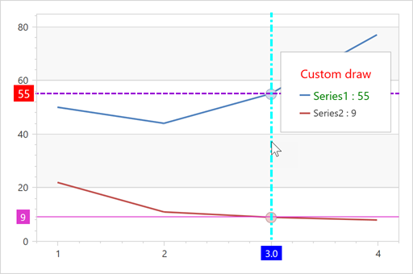

<!-- default badges list -->

<!-- default badges end -->
# Charts for WPF - How to Customize Crosshair Cursor Elements

This example shows how to use the [ChartControl.CustomDrawCrosshair](https://docs.devexpress.com/WPF/DevExpress.Xpf.Charts.ChartControl.CustomDrawCrosshair) event to customize the crosshair cursor. For example, you can use this event to paint crosshair label items depending on the highlighted point value.

Enable the following properties before the crosshair is customized to display crosshair axis lines and labels:

* [CrosshairOptions.ShowArgumentLabels](https://docs.devexpress.com/WPF/DevExpress.Xpf.Charts.CrosshairOptions.ShowArgumentLabels?p=netframework)
* [CrosshairOptions.ShowArgumentLine](https://docs.devexpress.com/WPF/DevExpress.Xpf.Charts.CrosshairOptions.ShowArgumentLine?p=netframework)
* [CrosshairOptions.ShowValueLabels](https://docs.devexpress.com/WPF/DevExpress.Xpf.Charts.CrosshairOptions.ShowValueLabels?p=netframework)
* [CrosshairOptions.ShowValueLine](https://docs.devexpress.com/WPF/DevExpress.Xpf.Charts.CrosshairOptionsBase.ShowValueLine?p=netframework)

## Files to Look At

* [MainWindow.xaml](./CS/CrosshairCustomDraw/MainWindow.xaml) (VB: [MainWindow.xaml](./VB/CrosshairCustomDraw/MainWindow.xaml))
* [MainWindow.xaml.cs](./CS/CrosshairCustomDraw/MainWindow.xaml.cs) (VB: [MainWindow.xaml.vb](./VB/CrosshairCustomDraw/MainWindow.xaml.vb))

## Documentation

* [Crosshair Cursor](https://docs.devexpress.com/WPF/14682/controls-and-libraries/charts-suite/chart-control/tooltip-and-crosshair-cursor/crosshair-cursor?p=netframework)

## More Examples

* [How to: show the Crosshair Cursor programmatically](https://github.com/DevExpress-Examples/how-to-show-the-crosshair-cursor-programmatically-t466164)
* [How to format values in a crosshair cursor with label patterns](https://github.com/DevExpress-Examples/how-to-format-values-in-a-crosshair-cursor-via-a-labels-patterns-e4478)
* [How to customize the appearance of crosshair axis labels](https://github.com/DevExpress-Exampleshow-to-customize-the-appearance-of-crosshair-axis-labels-e4074)
* [How to customize Crosshair Label appearance](https://github.com/DevExpress-Examples/how-to-customize-the-crosshair-label-appearance-t478135)
